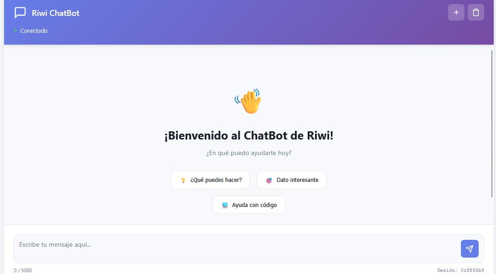
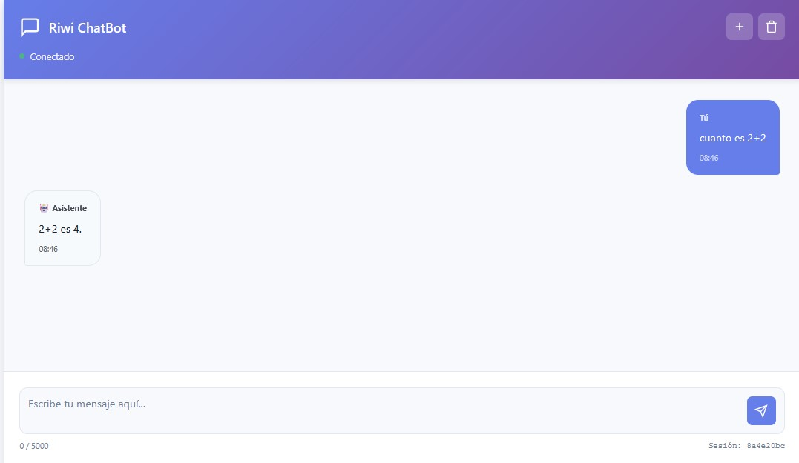
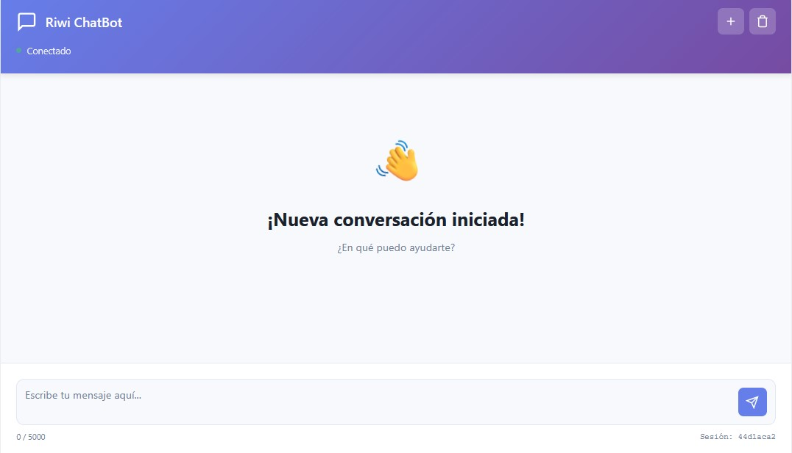

<<<<<<< HEAD
# ChatBot
=======
# 🤖 Riwi ChatBot - AI21 Studio

Sistema completo de chatbot inteligente desarrollado con Spring Boot y AI21 Studio API. Incluye backend robusto con arquitectura en capas y frontend moderno e interactivo.


---

## 📋 Tabla de Contenidos

- [Características](#-características)
- [Tecnologías](#-tecnologías)
- [Arquitectura del Proyecto](#-arquitectura-del-proyecto)
- [Estructura de Carpetas](#-estructura-de-carpetas)
- [Instalación](#-instalación)
- [Configuración](#-configuración)
- [Uso](#-uso)
- [Endpoints del API](#-endpoints-del-api)
- [Capturas de Pantalla](#-capturas-de-pantalla)
- [Arquitectura en Capas](#-arquitectura-en-capas)
- [Contribución](#-contribución)

---

## ✨ Características

### Backend (Spring Boot)

- ✅ **Arquitectura en capas** (Controller → Service → Client)
- ✅ **Integración con AI21 Studio API**
- ✅ **Gestión de sesiones de conversación**
- ✅ **Historial de mensajes en memoria**
- ✅ **Validaciones con Jakarta Validation**
- ✅ **Manejo robusto de errores**
- ✅ **Configuración externalizada**
- ✅ **CORS configurado**
- ✅ **Health check endpoint**
- ✅ **Logging con SLF4J**

### Frontend (HTML/CSS/JS)

- ✨ **Interfaz moderna y responsive**
- 💬 **Chat en tiempo real**
- 🔄 **Gestión de sesiones** (crear nueva, limpiar)
- 📝 **Historial de conversación**
- 🎯 **Quick actions** (botones de acceso rápido)
- 🔔 **Notificaciones toast**
- 🌐 **Detección de conexión online/offline**
- 🔄 **Reconexión automática**
- 💾 **Exportar conversaciones**
- ⌨️ **Atajos de teclado**
- 📱 **Diseño responsive**

---

## 🛠 Tecnologías

### Backend

| Tecnología | Versión | Propósito |
|-----------|---------|-----------|
| Java | 17+ | Lenguaje base |
| Spring Boot | 3.x | Framework principal |
| Spring Web | 3.x | REST API |
| RestTemplate | 3.x | Cliente HTTP |
| Jakarta Validation | 3.x | Validaciones |
| SLF4J + Logback | 2.x | Logging |
| Maven | 3.8+ | Gestión de dependencias |

### Frontend

| Tecnología | Versión | Propósito |
|-----------|---------|-----------|
| HTML5 | HTML5 | Estructura |
| CSS3 | CSS3 | Estilos |
| JavaScript | ES6+ | Lógica |

### Servicios Externos

- **AI21 Studio API** - Inteligencia artificial conversacional

---

## 🏗 Arquitectura del Proyecto

```
┌─────────────────────────────────────────────────────┐
│                    FRONTEND                         │
│          (HTML, CSS, JavaScript)                    │
│  ┌──────────┐  ┌──────────┐  ┌──────────┐           │
│  │   UI     │  │  Chat.js │  │ Styles   │           │
│  │ Components│  │  Logic   │  │   CSS    │          │
│  └──────────┘  └──────────┘  └──────────┘           │
└─────────────────────┬───────────────────────────────┘
                      │ HTTP/REST
                      ▼
┌───────────────────────────────────────────────────┐
│                SPRING BOOT BACKEND                │
│                                                   │
│  ┌────────────────────────────────────────────┐   │
│  │         CONTROLLER LAYER                   │   │
│  │         ChatController.java                │   │
│  │    (Maneja peticiones HTTP)                │   │
│  └──────────────────┬─────────────────────────┘   │
│                     │                             │
│  ┌─────────────────▼──────────────────────────┐   │
│  │         SERVICE LAYER                      │   │
│  │  ┌──────────────┐  ┌──────────────┐        │   │
│  │  │ ChatService  │  │ AI21Service  │        │   │
│  │  │  (Lógica)    │  │  (API Logic) │        │   │
│  │  └──────────────┘  └──────────────┘        │   │
│  └──────────────────┬─────────────────────────┘   │
│                     │                             │
│  ┌─────────────────▼──────────────────────────┐   │
│  │         CLIENT LAYER                       │   │
│  │  ┌──────────────┐  ┌──────────────┐        │   │
│  │  │ AI21Client   │  │ ApiResponse  │        │   │
│  │  │ (HTTP Client)│  │   (Mapper)   │        │   │
│  │  └──────────────┘  └──────────────┘        │   │
│  └──────────────────┬─────────────────────────┘   │
│                     │                             │
│  ┌─────────────────▼──────────────────────────┐   │
│  │         MODEL LAYER                        │   │
│  │  ┌──────────┐ ┌──────────┐ ┌──────────┐    │   │
│  │  │ChatMessage││ChatRequest││DTO (AI21)│    │   │
│  │  └──────────┘ └──────────┘ └──────────┘    │   │
│  └────────────────────────────────────────────┘   │
│                                                   │
│  ┌──────────────────────────────────────────┐     │
│  │         CONFIG LAYER                     │     │
│  │  ApiConfig | RestTemplateConfig          │     │
│  └──────────────────────────────────────────┘     │
└──────────────────────┬────────────────────────────┘
                       │ HTTPS
                       ▼
┌─────────────────────────────────────────────────────┐
│              AI21 STUDIO API                        │
│         (Servicio de IA externo)                    │
└─────────────────────────────────────────────────────┘
```

---

## 📁 Estructura de Carpetas

```
chatbot-project/
├── src/
│   ├── main/
│   │   ├── java/com/riwi/chat/
│   │   │   ├── DemoApplication.java           # Clase principal
│   │   │   │
│   │   │   ├── client/                        # ← CAPA CLIENT
│   │   │   │   ├── AI21Client.java           # Cliente HTTP
│   │   │   │   └── ApiResponse.java          # Wrapper de respuestas
│   │   │   │
│   │   │   ├── config/                        # ← CONFIGURACIÓN
│   │   │   │   ├── ApiConfig.java            # Config de API Keys
│   │   │   │   └── RestTemplateConfig.java   # Config HTTP Client
│   │   │   │
│   │   │   ├── controller/                    # ← CAPA CONTROLLER
│   │   │   │   └── ChatController.java       # REST Endpoints
│   │   │   │
│   │   │   ├── model/                         # ← MODELOS
│   │   │   │   ├── ChatMessage.java          # Modelo interno
│   │   │   │   ├── ChatRequest.java          # Request del frontend
│   │   │   │   ├── ChatResponse.java         # Response al frontend
│   │   │   │   └── dto/                      # DTOs para AI21 API
│   │   │   │       ├── AI21Request.java
│   │   │   │       └── AI21Response.java
│   │   │   │
│   │   │   └── service/                       # ← CAPA SERVICE
│   │   │       ├── AI21Service.java          # Lógica AI21
│   │   │       └── ChatService.java          # Lógica del chat
│   │   │
│   │   └── resources/
│   │       ├── application.properties         # Configuración principal
│   │       ├── static/                        # Archivos estáticos
│   │       │   ├── css/
│   │       │   │   └── style.css
│   │       │   └── js/
│   │       │       └── chat.js
│   │       └── templates/
│   │           └── chat.html                  # Template HTML
│   │
│   └── test/                                  # Tests
│
├── pom.xml                                    # Maven dependencies
├── mvnw                                       # Maven wrapper
├── mvnw.cmd
└── README.md                                  # Este archivo
```

---

## 🚀 Instalación

### Prerrequisitos

- ☕ **Java 17+** ([Descargar](https://adoptium.net/))
- 📦 **Maven 3.8+** ([Descargar](https://maven.apache.org/download.cgi))
- 🔑 **Cuenta en AI21 Studio** ([Registrarse](https://studio.ai21.com/))
- 🌐 **Navegador moderno** (Chrome, Firefox, Edge, Safari)

### Paso 1: Clonar el repositorio

```bash
git clone https://github.com/tu-usuario/riwi-chatbot.git
cd riwi-chatbot
```

### Paso 2: Obtener API Key de AI21 Studio

1. Regístrate en [AI21 Studio](https://studio.ai21.com/)
2. Ve a **API Keys** en el dashboard
3. Crea una nueva API Key
4. Copia la API Key generada

### Paso 3: Configurar el backend

Crea/edita el archivo `src/main/resources/application.properties`:

```properties
# ========== CONFIGURACIÓN DEL SERVIDOR ==========
server.port=8080
spring.application.name=riwi-chatbot

# ========== CONFIGURACIÓN AI21 STUDIO ==========
chatbot.ai21.api.key=TU_API_KEY_AQUI
chatbot.ai21.api.url=https://api.ai21.com/studio/v1/chat/completions
chatbot.ai21.api.model=jamba-1.5-mini
chatbot.ai21.api.max-tokens=300
chatbot.ai21.api.temperature=0.7

# ========== CONFIGURACIÓN HTTP CLIENT ==========
chatbot.http.client.connect-timeout=10000
chatbot.http.client.read-timeout=30000
chatbot.http.client.max-connections=20

# ========== CONFIGURACIÓN CORS ==========
chatbot.cors.allowed-origins=http://localhost:8080,http://localhost:8000,http://127.0.0.1:8000
chatbot.cors.allowed-methods=GET,POST,PUT,DELETE,OPTIONS
chatbot.cors.allowed-headers=*

# ========== LOGGING ==========
logging.level.com.riwi.chat=INFO
logging.pattern.console=%d{yyyy-MM-dd HH:mm:ss} - %msg%n
```

### Paso 4: Compilar y ejecutar

#### Opción A: Usando Maven

```bash
# Compilar el proyecto
mvn clean install

# Ejecutar la aplicación
mvn spring-boot:run
```

#### Opción B: Usando Java directamente

```bash
# Compilar
mvn clean package

# Ejecutar el JAR
java -jar target/chatbot-1.0.0.jar
```

El backend estará disponible en: `http://localhost:8080`

### Paso 5: Verificar instalación

Abre tu navegador y visita:

```
http://localhost:8080/api/chat/health
```

Deberías ver una respuesta JSON como:

```json
{
  "status": "UP",
  "service": "ChatBot Service - AI21 Studio",
  "timestamp": "2025-10-09T10:30:00",
  "stats": "Conversaciones activas: 0, Configurado: Sí"
}
```

---

## ⚙️ Configuración

### Variables de Entorno (Alternativa)

En lugar de `application.properties`, puedes usar variables de entorno:

#### Linux/Mac:

```bash
export CHATBOT_AI21_API_KEY="tu-api-key"
export CHATBOT_AI21_API_URL="https://api.ai21.com/studio/v1/chat/completions"
export CHATBOT_AI21_API_MODEL="jamba-1.5-mini"
```

#### Windows:

```cmd
set CHATBOT_AI21_API_KEY=tu-api-key
set CHATBOT_AI21_API_URL=https://api.ai21.com/studio/v1/chat/completions
set CHATBOT_AI21_API_MODEL=jamba-1.5-mini
```

### Modelos Disponibles en AI21 Studio

| Modelo | Descripción 
|--------|-------------|
| `jamba-mini-1.7` | Rápido y económico |
| `jamba-large-1.7` | Mayor capacidad |

---

## 💻 Uso

### 1. Iniciar el Backend

```bash
mvn spring-boot:run
```

Verás en la consola:

```
  ____  _          _ 
 |  _ \(_)_      _(_)
 | |_) | \ \ /\ / / |
 |  _ <| |\ V  V /| |
 |_| \_\_| \_/\_/ |_|
   ChatBot v1.0

2025-10-09 10:30:00 - Aplicación iniciada en el puerto 8080
2025-10-09 10:30:00 - AI21 Client configurado correctamente
```

### 2. Acceder al Frontend

**Opción A: Servido por Spring Boot**

Abre tu navegador en:
```
http://localhost:8080/chat.html
```

**Opción B: Servidor independiente**

```bash
cd src/main/resources/static
python -m http.server 8000
```

Luego abre: `http://localhost:8000`

### 3. Usar el Chat

1. **Escribir mensaje**: Escribe tu pregunta en el campo de texto
2. **Enviar**: Presiona `Enter` o click en el botón de enviar ✈️
3. **Quick Actions**: Usa los botones de acceso rápido para preguntas comunes
4. **Nueva conversación**: Click en el botón `+` para empezar de cero
5. **Limpiar historial**: Click en el botón 🗑️ para borrar el historial

---

## 📡 Endpoints del API

### Base URL: `http://localhost:8080/api/chat`

#### 1. 💬 Enviar Mensaje

```http
POST /api/chat/message
Content-Type: application/json

{
  "message": "¿Cuánto es 2+2?",
  "sessionId": "550e8400-e29b-41d4-a716-446655440000"
}
```

**Respuesta:**

```json
{
  "success": true,
  "message": "2+2 es igual a 4.",
  "sessionId": "550e8400-e29b-41d4-a716-446655440000",
  "timestamp": "2025-10-09T10:30:00"
}
```

---

#### 2. 🆕 Nueva Sesión

```http
GET /api/chat/session/new
```

**Respuesta:**

```json
{
  "success": true,
  "sessionId": "44d1aca2-f583-4b9e-a3e1-e8a4e02e8b5c",
  "message": "Nueva sesión creada",
  "timestamp": "2025-10-09T10:30:00"
}
```

---

#### 3. 📜 Obtener Historial

```http
GET /api/chat/history/{sessionId}
```

**Respuesta:**

```json
{
  "success": true,
  "sessionId": "550e8400-e29b-41d4-a716-446655440000",
  "messages": [
    {
      "role": "user",
      "content": "Hola"
    },
    {
      "role": "assistant",
      "content": "¡Hola! ¿Cómo puedo ayudarte?"
    }
  ],
  "messageCount": 2,
  "timestamp": "2025-10-09T10:30:00"
}
```

---

#### 4. 🗑️ Limpiar Historial

```http
DELETE /api/chat/history/{sessionId}
```

**Respuesta:**

```json
{
  "success": true,
  "message": "Historial limpiado exitosamente",
  "sessionId": "550e8400-e29b-41d4-a716-446655440000",
  "timestamp": "2025-10-09T10:30:00"
}
```

---

#### 5. Health Check

```http
GET /api/chat/health
```

**Respuesta:**

```json
{
  "status": "UP",
  "service": "ChatBot Service - AI21 Studio",
  "timestamp": "2025-10-09T10:30:00",
  "stats": "Conversaciones activas: 5, Configurado: Sí"
}
```

---

## 📸 Capturas de Pantalla

### Interfaz Principal


*Pantalla de bienvenida con quick actions y diseño moderno*

### Conversación Activa


*Ejemplo de conversación con el asistente AI21*

### Nueva Conversación


*Vista al iniciar una nueva conversación*

### Características del UI:

- ✨ **Header dinámico** con estado de conexión
- 💬 **Burbujas de chat** diferenciadas por rol (usuario/asistente)
- 🎯 **Quick actions** para preguntas frecuentes
- ⌨️ **Textarea auto-expandible**
- 🔔 **Notificaciones toast** para feedback
- 📱 **Diseño responsive** (mobile-first)
- 🌙 **Colores modernos** con gradientes

---

## 🏛 Arquitectura en Capas

### 1. **Controller Layer** (Capa de Presentación)

**Archivo:** `ChatController.java`

**Responsabilidades:**
- Recibir peticiones HTTP
- Validar datos de entrada
- Delegar lógica al Service Layer
- Retornar respuestas HTTP
- Manejo de excepciones HTTP

**Endpoints:**
- `POST /api/chat/message`
- `POST /api/chat/conversation`
- `GET /api/chat/history/{sessionId}`
- `DELETE /api/chat/history/{sessionId}`
- `GET /api/chat/session/new`
- `GET /api/chat/health`

---

### 2. **Service Layer** (Capa de Negocio)

**Archivos:** `ChatService.java` y `AI21Service.java`

**Responsabilidades:**
- Lógica de negocio del chatbot
- Gestión de conversaciones
- Validaciones de negocio
- Construcción de requests para AI21
- Manejo de historial en memoria

**Funcionalidades:**
- Procesar mensajes de usuario
- Mantener contexto de conversación
- Crear mensajes del sistema/usuario/asistente
- Validar y sanitizar inputs
- Limpiar conversaciones antiguas

---

### 3. **Client Layer** (Capa de Integración)

**Archivos:** `AI21Client.java` y `ApiResponse.java`

**Responsabilidades:**
- Comunicación HTTP con AI21 Studio API
- Construcción de headers (autenticación)
- Mapeo de requests/responses
- Manejo de errores HTTP (4xx, 5xx)
- Retry logic y timeouts

**Características:**
- RestTemplate configurado
- Bearer Token authentication
- Manejo de excepciones HTTP
- Validación de configuración
- Logging detallado

---

### 4. **Model Layer** (Capa de Datos)

**Archivos:**
- `ChatMessage.java` - Modelo interno
- `ChatRequest.java` - Request del frontend
- `ChatResponse.java` - Response al frontend
- `AI21Request.java` - Request a AI21 API
- `AI21Response.java` - Response de AI21 API

**Responsabilidades:**
- Definir estructura de datos
- Validaciones con Jakarta Validation
- Serialización/Deserialización JSON
- DTOs para comunicación entre capas

---

### 5. **Config Layer** (Capa de Configuración)

**Archivos:** `ApiConfig.java` y `RestTemplateConfig.java`

**Responsabilidades:**
- Configuración de beans de Spring
- Externalización de configuraciones
- CORS configuration
- RestTemplate con timeouts
- Validación de configuraciones

---

## 🧪 Testing

### Ejecutar Tests

```bash
mvn test
```

### Test Endpoints con cURL

```bash
# Health Check
curl http://localhost:8080/api/chat/health

# Nueva sesión
curl http://localhost:8080/api/chat/session/new

# Enviar mensaje
curl -X POST http://localhost:8080/api/chat/message \
  -H "Content-Type: application/json" \
  -d '{"message":"Hola","sessionId":"test-123"}'
```

---

## 🐛 Solución de Problemas

### Error: "API Key de AI21 Studio no configurada"

**Solución:**
1. Verifica que `application.properties` tenga la API Key
2. Asegúrate de que la API Key sea válida
3. Revisa que no haya espacios antes/después de la key

---

### Error: "CORS policy: No 'Access-Control-Allow-Origin' header"

**Solución:**
```properties
# En application.properties
chatbot.cors.allowed-origins=http://localhost:8000,http://localhost:8080
```

---

### Error: "Connect timed out"

**Solución:**
1. Verifica tu conexión a internet
2. Aumenta los timeouts en `application.properties`:
```properties
chatbot.http.client.connect-timeout=20000
chatbot.http.client.read-timeout=60000
```

---

### Frontend no se conecta al backend

**Checklist:**
- [ ] Backend corriendo en puerto 8080
- [ ] CORS configurado correctamente
- [ ] URL del API correcta en `chat.js`
- [ ] Consola del navegador sin errores
- [ ] Health endpoint responde: `http://localhost:8080/api/chat/health`

---

## 🔐 Seguridad

### Buenas Prácticas Implementadas

- ✅ API Key en variables de entorno (no en código)
- ✅ Validación de inputs con Jakarta Validation
- ✅ Escape de HTML en frontend (previene XSS)
- ✅ CORS restrictivo (solo orígenes permitidos)
- ✅ Límites de caracteres en mensajes
- ✅ Timeouts en peticiones HTTP
- ✅ Logging sin exponer datos sensibles
- ✅ Manejo seguro de excepciones

### Para Producción

```properties
# No expongas tu API Key
chatbot.ai21.api.key=${AI21_API_KEY}

# CORS restrictivo
chatbot.cors.allowed-origins=https://tu-dominio.com

# HTTPS obligatorio
server.ssl.enabled=true
```

---

## 📊 Métricas y Monitoreo

### Health Check

El endpoint `/api/chat/health` proporciona:

- Estado del servicio (UP/DOWN)
- Número de conversaciones activas
- Estado de configuración
- Timestamp

### Logging

Los logs incluyen:

- Requests y responses
- Errores y excepciones
- Tokens consumidos
- Tiempos de respuesta

```properties
# Nivel de logging
logging.level.com.riwi.chat=DEBUG
```

---

## 🤝 Contribución

### Cómo Contribuir

1. **Fork** el proyecto
2. Crea una **rama** para tu feature:
   ```bash
   git checkout -b feature/AmazingFeature
   ```
3. **Commit** tus cambios:
   ```bash
   git commit -m 'Add some AmazingFeature'
   ```
4. **Push** a la rama:
   ```bash
   git push origin feature/AmazingFeature
   ```
5. Abre un **Pull Request**

### Guía de Estilo

- Seguir convenciones de Java (CamelCase)
- Documentar métodos públicos con JavaDoc
- Tests para nuevas funcionalidades
- Commits descriptivos en español

---

## 📄 Licencia

Este proyecto es parte del programa **Riwi** - Uso educativo.

## 🗺 Roadmap

### Versión 1.1 (Próxima)

- [ ] Persistencia en base de datos (PostgreSQL)
- [ ] Autenticación de usuarios (JWT)
- [ ] Sistema de roles
- [ ] Exportar conversaciones a PDF
- [ ] Soporte para imágenes
- [ ] Modo oscuro

### Versión 2.0 (Futuro)

- [ ] Integración con múltiples modelos de IA
- [ ] WebSocket para chat en tiempo real
- [ ] Panel de administración
- [ ] Análisis de sentimientos
- [ ] Multi-idioma
- [ ] App móvil

---

<div align="center">

</div>
>>>>>>> 5ee033bda55afcf0aa298e3af66e575dd44b0b39
